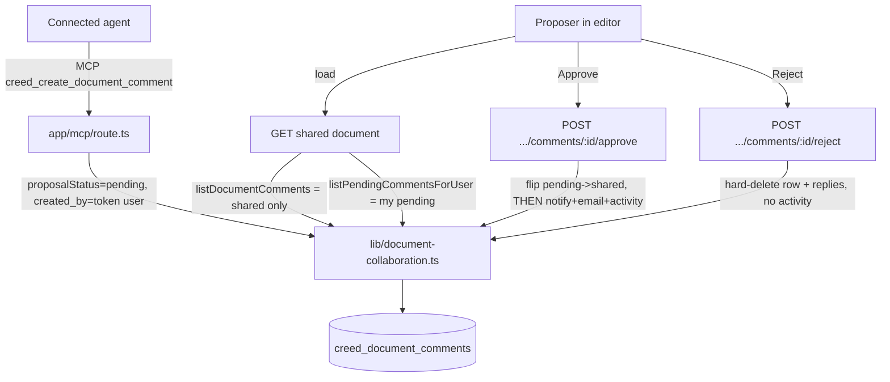

# Design Document

## Overview

Agent-proposed comments let a connected agent (over MCP) leave comments on a
shared document on the user's behalf. An agent comment is created as a private
**pending** comment, visible only to the user whose token the agent used (the
Proposer). The Proposer reviews it in the document editor and approves it;
approval publishes it as a normal comment authored by the Proposer. No other
workspace member ever sees or is notified about a pending comment.

The design **extends the existing `creed_document_comments` table and the
existing comment code paths** in `lib/document-collaboration.ts`. It reuses the
proposal *pattern* (pending -> approve -> live) but not the
`creed_document_proposals` table, because a comment already has the structure it
needs (threading, mentions, `reference_quote` anchoring, open/resolved status)
and stuffing that through a jsonb `draft` and rebuilding it on approval would be
strictly more code with more leak surface.

The central design constraint is **leak prevention**: a pending comment, its
mentions, and its activity must never reach a non-Proposer through any read path,
and mention notifications / emails / workspace activity must fire exactly once,
at approval, never at pending creation.

## Architecture



Nothing about the shared-comment path changes: a comment created in the editor by
a signed-in user defaults to `proposal_status = 'shared'` and behaves exactly as
today (immediate notifications, email, activity).

## Data Models

### Migration (forward-only, idempotent)

New file `supabase/migrations/<timestamp>_add_comment_proposal_status.sql`,
matching the existing `creed_*` conventions (see
`20260701120000_add_workspace_proposal_versioning.sql`).

```sql
-- Agent-proposed comments: a comment can be a private pending proposal until
-- its Proposer approves it. proposal_status is orthogonal to status
-- (open/resolved). Privacy is enforced in the application layer; RLS stays
-- using(true) as the backstop, consistent with the other shared-doc tables.
alter table public.creed_document_comments
  add column if not exists proposal_status text not null default 'shared';

alter table public.creed_document_comments
  add column if not exists proposed_by_agent_label text;

do $$
begin
  if not exists (
    select 1 from pg_constraint
    where conname = 'creed_document_comments_proposal_status_check'
      and conrelid = 'public.creed_document_comments'::regclass
  ) then
    alter table public.creed_document_comments
      add constraint creed_document_comments_proposal_status_check
      check (proposal_status in ('pending', 'shared'));
  end if;
end $$;

-- Supports the Proposer's private pending lookup and keeps the shared-list
-- filter cheap.
create index if not exists creed_document_comments_document_proposal_idx
  on public.creed_document_comments (document_id, proposal_status, created_by);
```

`proposal_status default 'shared'` means every existing row and every future
human-editor comment is a normal comment with no migration backfill needed.

### Type changes (`lib/document-collaboration.ts`)

`CommentRow` gains `proposal_status: string | null` and
`proposed_by_agent_label: string | null`, and both are added to
`COMMENT_COLUMNS`.

`DocumentComment` gains:

```ts
export type DocumentComment = {
  // ...existing fields...
  proposalStatus: "pending" | "shared";
  proposedByAgentLabel: string | null; // only surfaced in the Proposer's pending view
};
```

`mapComment` maps the two new columns (`proposal_status` normalized to
`'pending' | 'shared'`, defaulting to `'shared'`).

## Components and Interfaces

### `lib/document-collaboration.ts`

**`createDocumentComment`** gains two optional inputs:

```ts
input: {
  // ...existing...
  proposalStatus?: "pending" | "shared";     // default "shared"
  proposedByAgentLabel?: string | null;      // set only for pending agent comments
}
```

Behavior:
- Insert sets `proposal_status` and `proposed_by_agent_label`. `created_by` is the
  actor (for agent comments this is the token user = the Proposer).
- **When `proposalStatus === "pending"`**: insert mention rows (so mentions are
  preserved for later) but write **no** `creed_notifications`, send **no**
  emails, and record **no** activity event. Return the comment with empty
  `notifications` and `pendingEmails`.
- **When `proposalStatus === "shared"`** (default): unchanged from today
  (notifications + pendingEmails + `comment.created` activity).

Extract the shared "resolve mentions -> insert notifications -> record activity
-> build pendingEmails" tail into a private helper `publishCommentSideEffects`
that both the shared-create path and `approveDocumentComment` call, so the
notification/email/activity logic lives in exactly one place.

**`listDocumentComments`** adds `.eq("proposal_status", "shared")` (or filters
after read) so it returns shared comments only, for everyone including the
Proposer. This is the single choke point for the shared view.

**`listPendingCommentsForUser(client, documentId, userId)`** (new): returns rows
where `proposal_status = 'pending'` and `created_by = userId`, mapped with
mentions. This is the only way pending comments are ever read, and it is always
scoped to the caller.

**`approveDocumentComment(client, { commentId, actorUserId })`** (new):
1. Read the row. If missing -> `not-found`.
2. If `created_by !== actorUserId` -> `forbidden` (before any mutation).
3. If `proposal_status !== 'pending'` -> treat as already shared (idempotent
   success, no duplicate side effects).
4. Update `proposal_status = 'shared'` (leave `created_by` unchanged).
5. Call `publishCommentSideEffects` once: resolve mentions from the body, insert
   `creed_notifications`, record the `comment.created` workspace activity, build
   `pendingEmails`.
6. Return `{ comment, notifications, pendingEmails }` so the route delivers
   emails exactly as the create route does today.

**`rejectDocumentComment(client, { commentId, actorUserId })`** (new):
1. Read the row. If missing -> `not-found`.
2. If `created_by !== actorUserId` -> `forbidden` (before any delete).
3. If it is a root comment, delete its replies first, then delete the row
   (mirrors `deleteDocumentComment`). Write **no** activity event.
4. Return `{ id, parentId }`.

Both approve and reject compare `actorUserId` to `created_by`; the document owner
has no special rights.

### MCP (`app/mcp/route.ts`)

`creed_create_document_comment` and `creed_reply_to_document_comment` call
`createDocumentComment` with `proposalStatus: "pending"`,
`proposedByAgentLabel: agentName`, `actorUserId: userId` (the token user),
`source: "mcp"`. They return `{ ok: true, outcome: "proposed", comment }` and do
**not** include notification records. A successful insert is kept regardless of
whether the response reaches the agent (no rollback; `outcome` is informational).

Tool descriptions are updated to state: the comment is recorded as a pending
proposal that the user approves before it is shared, and once approved it appears
authored by the user (not the agent). `creed_read_document` and
`creed_list_document_comments` already call `listDocumentComments`, which now
excludes pending, so agents never read another user's pending comments; an agent
also does not see its own pending comments back through these tools (acceptable,
since the tool result already reported the pending outcome).

### HTTP routes + editor

- The shared-document editor load (the server component / route that builds
  `SharedDocumentFilePayload`) calls `listDocumentComments` for shared comments
  and, for the signed-in viewer, `listPendingCommentsForUser(documentId,
  currentUserId)`. The payload carries `comments` (shared) and a new
  `pendingComments` (the viewer's own) so the client can render and style them
  distinctly.
- New session-authed routes (both `requireApiAuth`, actor = `auth.user.id`):
  - `POST /api/app/documents/[id]/comments/[commentId]/approve` ->
    `approveDocumentComment`, then `deliverPendingMentionEmails`, then return the
    shared comment.
  - `POST /api/app/documents/[id]/comments/[commentId]/reject` ->
    `rejectDocumentComment`.
  Map `forbidden`/`not-found`/`invalid` to 403/404/400.
- `components/creed/file-screen.tsx`: render pending comments (the viewer's own)
  as (a) a grouped "Pending from your agent" section in the comment sidebar and
  (b) inline pending markers at their `reference_quote` anchors, each with
  Approve / Reject. On approve, move the comment from `pendingComments` into
  `documentComments` (or refetch); on reject, drop it. Pending comments show
  `proposedByAgentLabel`. Non-proposers never receive pending comments in their
  payload, so nothing special is needed to hide them.

### Docs / contract

- `AGENTS.md`: document that agents may propose comments on the user's behalf,
  which become the user's comments once approved.
- `lib/creed-data.ts:collaborationRules`: add a line describing the capability
  (this ships to every agent; test across at least 2 models per repo rule).
- MCP tool descriptions: as above.

## Create -> approve / reject flows

```mermaid
sequenceDiagram
  participant A as Agent (MCP)
  participant S as Comment_Store
  participant P as Proposer (editor)
  participant W as Workspace member

  A->>S: create comment (pending, created_by=Proposer, agentLabel)
  S-->>A: { outcome: "proposed", comment }
  Note over S: no notifications, no emails, no activity
  W->>S: load document
  S-->>W: shared comments only (pending excluded)
  P->>S: load document
  S-->>P: shared comments + my pending comments
  alt Approve
    P->>S: approve(commentId)
    Note over S: forbidden unless created_by == Proposer
    S->>S: proposal_status -> shared; publishCommentSideEffects()
    S-->>P: shared comment (+ emails delivered)
    W->>S: next load -> comment now visible + activity present
  else Reject
    P->>S: reject(commentId)
    S->>S: delete row (+ replies), no activity
    S-->>P: removed
  end
```

## Correctness properties

1. **Pending privacy.** No read path returns a pending comment to anyone but its
   `created_by`. `listDocumentComments` excludes all pending;
   `listPendingCommentsForUser` is always scoped to the caller. (Reqs 6.1-6.6, 9.3)
2. **Deferred side effects.** No `creed_notifications` row, email, or activity
   event exists for a comment while `proposal_status = 'pending'`. (Reqs 7.1, 7.2, 8.1, 8.3)
3. **Exactly-once publish.** Approval fires mention notifications, emails, and the
   `comment.created` activity exactly once; a second approve is a no-op. (Reqs 7.3, 7.4, 8.2)
4. **Authority.** Only `created_by` (the Proposer) can approve or reject; the
   document owner cannot. Checked before any mutation. (Reqs 3.5, 4.4, 5.1-5.3)
5. **Reject cleanliness.** Reject deletes the row and its replies and writes no
   activity. (Reqs 4.1-4.3)
6. **Authorship.** Approval never changes `created_by`; the shared comment is the
   Proposer's, and `proposed_by_agent_label` is never shown to workspace
   members. (Reqs 3.1-3.3)
7. **Human path unchanged.** Editor comments default to `proposal_status =
   'shared'` and keep full existing behavior. (Reqs 1.5, 2.4)

## Leak-prevention analysis

- **Single choke point.** Every shared read goes through `listDocumentComments`,
  which filters to `proposal_status = 'shared'`. Pending reads go through the one
  Proposer-scoped function. There is no third read path (MCP `creed_read_document`
  and `creed_list_document_comments` both call `listDocumentComments`).
- **No pending side effects.** Because `createDocumentComment` writes zero
  notifications/emails/activity for pending, there is no secondary surface
  (notification feed, activity feed, email) that could reveal a pending comment.
- **RLS backstop.** `using(true)` is unchanged (consistent with existing tables);
  the app-layer filter is the guard, matching the rest of the codebase where all
  reads go through the admin client behind `requireApiAuth`.
- **Reply threading.** A reply to a pending comment is itself pending-scoped by
  its parent; replies are only creatable by the Proposer in their private view.
  (Agents reply via MCP as pending too.)

## Error Handling

All new store functions return the existing `MutationResult<T>` discriminated
union (`{ ok: true; value }` or `{ ok: false; code; error }`) so routes map codes
uniformly, matching `document-editing.ts` and the rest of `document-collaboration.ts`.

- **Authorization** (`forbidden`): approve/reject by a non-`created_by` actor is
  rejected before any mutation. Routes return 403.
- **Missing comment** (`not-found`): approve/reject of a non-existent id returns
  404.
- **Already shared** (approve): if `proposal_status` is already `'shared'`, treat
  as an idempotent success and skip side effects, so a double-click or retry
  cannot double-notify.
- **Invalid input** (`invalid`): empty body on create returns 400 (existing
  behavior retained).
- **Notification/email failures on approval**: emails are delivered via
  `deliverPendingMentionEmails` after the status flip and are best-effort (each
  email's status is recorded on its notification row, as today). A failed email
  does not roll back the approval; the comment stays shared.
- **MCP create response failure**: a successfully inserted pending comment is
  never rolled back if the tool response is not delivered; `outcome` is
  informational (Req 11.4).
- **Migration**: additive and idempotent (`add column if not exists`, guarded
  constraint), so re-running is safe and existing rows default to `'shared'`.

## Testing strategy

Unit tests in `tests/` using the existing `tests/helpers/fake-supabase.ts`
harness, co-located with the store functions:

- `createDocumentComment` with `proposalStatus: 'pending'` writes the columns and
  writes **no** notifications/activity; with default `'shared'` behaves as today.
- `listDocumentComments` excludes pending rows (including the caller's own).
- `listPendingCommentsForUser` returns only the caller's pending rows.
- `approveDocumentComment`: forbidden for a non-`created_by` actor; flips to
  shared; produces notifications + activity exactly once; second approve is a
  no-op.
- `rejectDocumentComment`: forbidden for a non-`created_by` actor; deletes the row
  and its replies; writes no activity.

These map to Correctness Properties 1-7.
