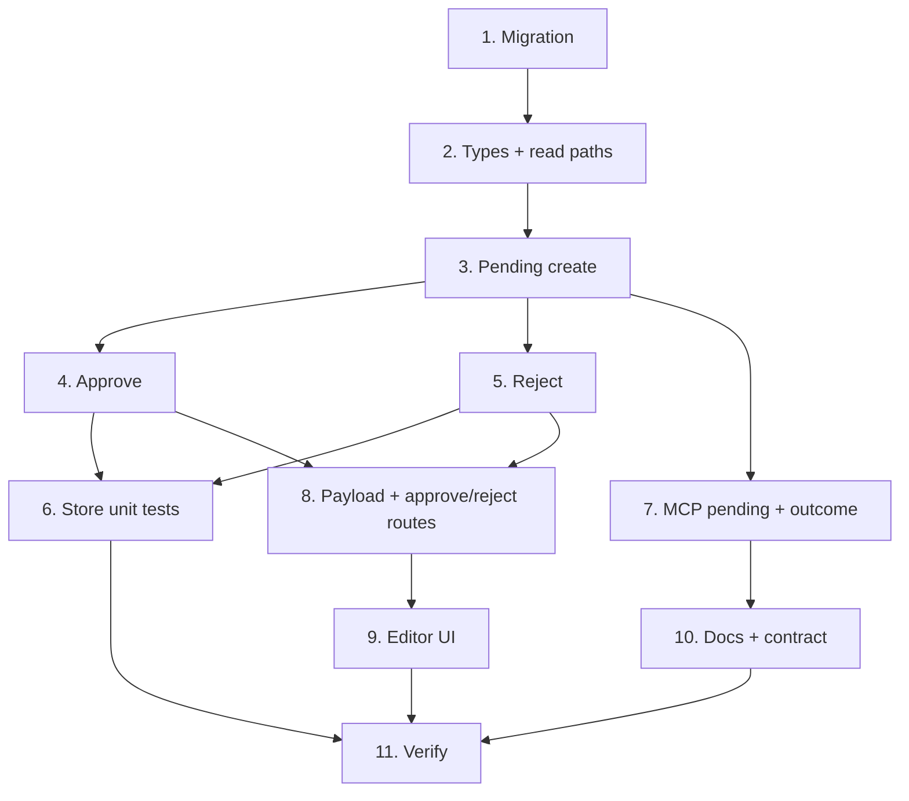

# Implementation Plan

## Overview

This plan implements agent-proposed comments by extending the existing
`creed_document_comments` table and the comment code paths in
`lib/document-collaboration.ts`, then wiring the pending -> approve/reject
lifecycle through MCP, session-authed routes, and the document editor. It starts
with the schema and the server store (with unit tests for the correctness
properties), then the MCP and HTTP surfaces, then the editor UI, and finishes
with the agent-facing docs/contract and a full verification pass.

## Tasks

- [x] 1. Add the comment proposal-status schema
  - Create a forward-only, idempotent migration under `supabase/migrations/` that adds `proposal_status text not null default 'shared'` (check in `('pending','shared')`) and `proposed_by_agent_label text` to `creed_document_comments`, plus an index on `(document_id, proposal_status, created_by)`.
  - Keep the existing RLS `using(true)` backstop unchanged.
  - _Requirements: 2.1, 2.2, 2.3, 2.4, 2.5_

- [x] 2. Extend the comment store types and read paths (`lib/document-collaboration.ts`)
  - [x] 2.1 Add `proposal_status` + `proposed_by_agent_label` to `CommentRow`, `COMMENT_COLUMNS`, the `DocumentComment` type (`proposalStatus`, `proposedByAgentLabel`), and `mapComment` (default `'shared'`).
    - _Requirements: 2.1, 2.3, 2.4_
  - [x] 2.2 Filter `listDocumentComments` to `proposal_status = 'shared'` only (excludes every caller's pending), and add `listPendingCommentsForUser(client, documentId, userId)` returning only pending rows where `created_by = userId`, with mentions mapped.
    - _Requirements: 6.1, 6.2, 6.3, 6.6_

- [x] 3. Extend comment creation for pending proposals (`lib/document-collaboration.ts`)
  - Add `proposalStatus?: "pending" | "shared"` (default `"shared"`) and `proposedByAgentLabel?` inputs to `createDocumentComment`.
  - Extract the mention-resolution -> notification-insert -> activity -> pendingEmails tail into a private `publishCommentSideEffects` helper.
  - When `proposalStatus === "pending"`: set the columns, keep mention rows, and write NO notifications, emails, or activity. When `"shared"`: unchanged behavior via the helper.
  - _Requirements: 1.1, 1.2, 1.3, 1.4, 1.5, 7.1, 7.2, 8.1, 8.3_

- [x] 4. Implement approve (`lib/document-collaboration.ts`)
  - `approveDocumentComment(client, { commentId, actorUserId })`: `forbidden` unless `created_by === actorUserId` (checked before any mutation); idempotent no-op if already `'shared'`; flip `proposal_status` to `'shared'` leaving `created_by` unchanged; call `publishCommentSideEffects` exactly once; return `{ comment, notifications, pendingEmails }`.
  - _Requirements: 3.1, 3.2, 3.3, 3.4, 3.5, 5.1, 5.2, 5.3, 7.3, 7.4, 8.2_

- [x] 5. Implement reject (`lib/document-collaboration.ts`)
  - `rejectDocumentComment(client, { commentId, actorUserId })`: `forbidden` unless `created_by === actorUserId` (before delete); delete replies then the row (mirroring `deleteDocumentComment`); write no activity event.
  - _Requirements: 4.1, 4.2, 4.3, 4.4, 5.2, 5.3, 7.5_

- [x] 6. Unit-test the store against the correctness properties
  - Using `tests/helpers/fake-supabase.ts`: pending create writes columns and no side effects; shared create unchanged; `listDocumentComments` excludes pending; `listPendingCommentsForUser` is caller-scoped; approve is proposer-only, exactly-once, idempotent on re-approve; reject is proposer-only, deletes row + replies, no activity.
  - _Requirements: 1.1, 3.5, 4.4, 6.1, 6.2, 7.1, 7.3, 8.1, 8.2_

- [x] 7. Route agent comments through the pending path (`app/mcp/route.ts`)
  - `creed_create_document_comment` and `creed_reply_to_document_comment` create with `proposalStatus: "pending"`, `proposedByAgentLabel: agentName`, `actorUserId: userId`; return `{ ok, outcome: "proposed", comment }` with no notification records; keep the insert even if the response is not delivered (no rollback).
  - Update both tool descriptions to state the comment is recorded as a pending proposal the user approves before it is shared, and once approved appears authored by the user.
  - _Requirements: 1.1, 1.3, 11.1, 11.2, 11.3, 11.4_

- [x] 8. Serve pending comments to the Proposer and add approve/reject routes
  - [x] 8.1 Add the Proposer's own pending comments to the shared-document editor payload (`listPendingCommentsForUser(documentId, currentUserId)`) as a distinct `pendingComments` field alongside shared `comments`.
    - _Requirements: 6.3, 9.1, 9.2_
  - [x] 8.2 Add `POST /api/app/documents/[id]/comments/[commentId]/approve` (calls `approveDocumentComment` then `deliverPendingMentionEmails`) and `POST .../reject` (calls `rejectDocumentComment`), both `requireApiAuth` with actor = `auth.user.id`, mapping `forbidden`/`not-found`/`invalid` to 403/404/400.
    - _Requirements: 3.5, 4.4, 5.1, 7.3, 7.4_

- [x] 9. Render pending comments in the document editor (`components/creed/file-screen.tsx`)
  - Render the viewer's own pending comments as a grouped "Pending from your agent" sidebar section AND inline pending markers at their `reference_quote` anchors, each showing `proposedByAgentLabel` with Approve / Reject actions.
  - On approve, move the comment into the shared comment list (or refetch); on reject, remove it. Non-proposers receive no pending comments in their payload.
  - _Requirements: 9.1, 9.2, 9.3, 9.4, 9.5, 10.4_

- [x] 10. Update agent-facing documentation and the contract
  - Update `AGENTS.md` (canonical; no `CLAUDE.md`) to describe agents proposing comments on the user's behalf that become the user's comments once approved.
  - Add a line to `lib/creed-data.ts:collaborationRules` describing the capability; verify across at least 2 models per the repo rule.
  - _Requirements: 12.1, 12.2, 12.3, 12.4_

- [x] 11. Verify the whole feature
  - Run `npx tsc --noEmit -p .`, `npm run lint`, `npm run build`, and `npm test`; fix any new errors. Confirm a pending comment is invisible to a second user across the editor load and both MCP read tools.
  - _Requirements: 6.1, 6.4, 6.5, 7.1, 8.1_

## Task Dependency Graph



```json
{
  "waves": [
    { "wave": 1, "tasks": ["1"] },
    { "wave": 2, "tasks": ["2"] },
    { "wave": 3, "tasks": ["3"] },
    { "wave": 4, "tasks": ["4", "5", "7"] },
    { "wave": 5, "tasks": ["6", "8", "10"] },
    { "wave": 6, "tasks": ["9"] },
    { "wave": 7, "tasks": ["11"] }
  ]
}
```

## Notes

- Reuse the existing comment model end to end; do not route comments through `creed_document_proposals`.
- `publishCommentSideEffects` is the single place notifications/emails/activity are produced, shared by shared-create and approve, so "exactly once at approval" is enforced in one location.
- The human editor comment path is unchanged: `proposal_status` defaults to `'shared'`.
- Privacy is enforced in the app layer (the two read functions); RLS `using(true)` is only a backstop.
