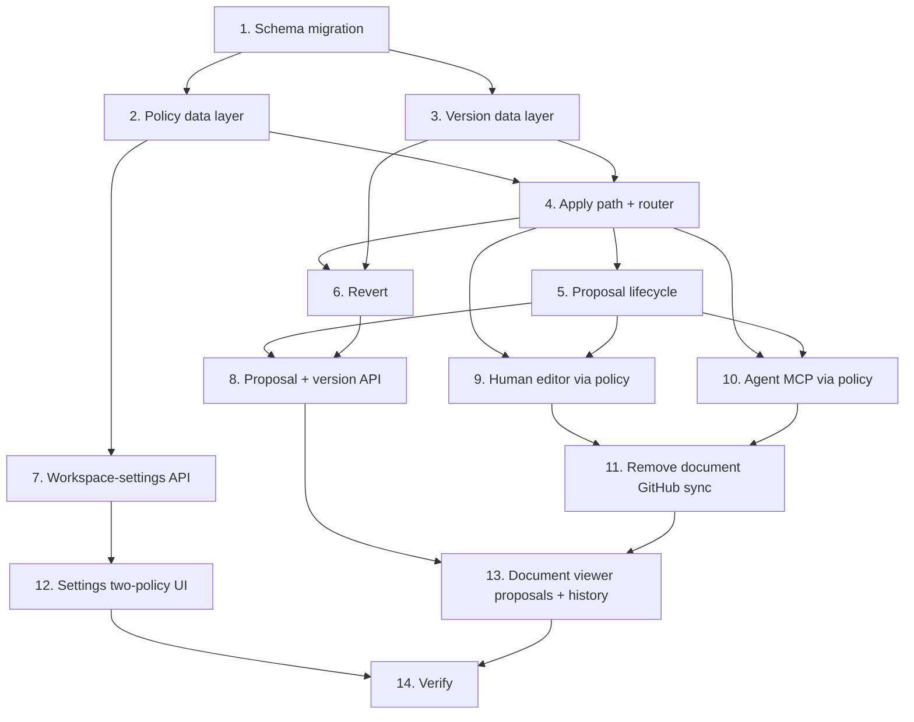

# Implementation Plan

## Overview

This plan implements the Model S (Supabase-only) proposal-based versioning feature for the shared document workspace. It starts with the database schema, builds the server data layers (policy, versions, apply path, proposals) with unit tests, exposes them via API and MCP, removes the document GitHub sync, and finishes with the settings and document-viewer UI. Each task references the requirements it satisfies; test tasks reference the correctness properties from the design.

## Tasks

- [x] 1. Add the Supabase schema for workspace settings, document proposals, and document versions
  - Create a forward-only, idempotent migration under `supabase/migrations/` following existing `creed_*` conventions and RLS patterns.
  - `creed_workspace_settings` singleton (`id boolean pk default true` with `check (id)`), columns `human_edit_policy`, `agent_edit_policy` (text, one of `cant-edit|propose|direct`, default `propose`), `updated_by`, `updated_at`.
  - `creed_document_proposals` (id, document_id fk, actor_type, author_user_id, author_agent_label, draft jsonb, section_id, summary, base_revision, status default `pending`, resolving boolean default false, created_at, resolved_at, resolved_by) with index on `(document_id, status)`.
  - `creed_document_versions` (id, document_id fk, revision, content, actor_type, author_user_id, author_agent_label, summary, source_proposal_id, created_at) — insert-only RLS (no update/delete).
  - Run `supabase db reset` against a local Supabase to confirm the migration applies cleanly.
  - _Requirements: 1.2, 1.3, 3.1, 3.4, 4.3, 8.1_

- [x] 2. Build the workspace edit-policy data layer
  - [x] 2.1 Add policy types and reader/writer in a new `lib/workspace-settings.ts`
    - Define `EditPolicyValue = "cant-edit" | "propose" | "direct"` and `ActorType = "human" | "agent"`.
    - `readWorkspaceEditPolicy(client)` returns `{ human, agent }`, defaulting each to `propose` when unset.
    - `saveWorkspaceEditPolicy(client, { patch, actorUserId })` upserting the singleton.
    - _Requirements: 1.4, 1.5, 1.6, 1.7_
  - [x] 2.2 Unit-test policy read/write defaults and independent evaluation
    - Cover: unset → `propose`; saving one policy leaves the other unchanged.
    - _Requirements: 1.4, 1.5, 1.7_

- [x] 3. Build the version-history data layer (`lib/document-versions.ts`)
  - `appendDocumentVersion(client, {...})` inserts an immutable version row with content, attribution, revision, summary, and optional `source_proposal_id`.
  - `listDocumentVersions(client, documentId)` returns versions newest-first with attribution + timestamp.
  - Unit-test that versions are insert-only and ordered.
  - _Requirements: 3.1, 3.2, 3.4, 8.1, 13.3_

- [x] 4. Build the shared apply path and policy router (`lib/document-editing.ts`)
  - [x] 4.1 Implement `applyDocumentChange(client, {...})`
    - Apply a `ProposalDraft` to the document's parsed sections (reuse the markdown parse/serialize used by `shared-documents`/`file-screen`), write content guarded on `expectedRevision` (reuse `updateSharedDocumentContent`), and append one `creed_document_versions` row, advancing `revision`.
    - Return conflict when `expectedRevision` is stale.
    - _Requirements: 3.1, 3.3, 7.1, 10.1, 10.2, 10.3_
  - [x] 4.2 Implement `routeDocumentEdit(client, {...})`
    - Read the policy for `actorType`; `cant-edit` → rejected; `propose` → create proposal; `direct` → `applyDocumentChange`.
    - Return a discriminated `{ outcome, proposal?, document?, version? }`.
    - _Requirements: 2.1, 2.2, 2.3, 2.4, 2.5, 2.6, 2.7_
  - [x] 4.3 Unit-test the routing table and versioning invariants
    - 2 actor types × 3 policies produce exactly the expected outcome (Property 1).
    - Every applied change appends exactly one version and advances revision by 1 (Property 2); stale revision is rejected without mutation (Property 6).
    - _Requirements: 2.1, 2.2, 2.3, 2.4, 2.5, 2.6, 2.7, 3.3, 10.1, 10.2, 10.3_

- [x] 5. Build the proposal lifecycle data layer (`lib/document-proposals.ts`)
  - [x] 5.1 Implement create + list
    - `createDocumentProposal(...)` inserts a `pending` row with attribution and `base_revision`.
    - `listDocumentProposals(client, documentId)` returns pending proposals (workspace-shared) with author/actor-type/attribution.
    - _Requirements: 4.1, 4.2, 4.3, 4.4, 4.5, 5.1, 5.3, 13.1, 13.2_
  - [x] 5.2 Implement accept with claim-lock, stale check, apply, and version
    - Atomically claim (`set resolving=true where id=? and status='pending' and resolving=false returning *`); no row → already resolved/locked.
    - If `base_revision` no longer applies cleanly → out-of-date, clear `resolving`.
    - Call `applyDocumentChange` attributed to the proposal author; set `status='accepted'`; record activity.
    - _Requirements: 6.1, 6.4, 6.6, 6.7, 7.1, 7.2, 7.3, 7.4, 13.1, 13.2_
  - [x] 5.3 Implement reject
    - Claim-lock, set `status='rejected'`, keep the row, record activity; never apply the change.
    - _Requirements: 6.2, 6.3, 6.4, 6.5_
  - [x] 5.4 Unit-test proposal invariants
    - Pending isolation (Property 4), at-most-once resolution under concurrent accept/reject (Property 5), reject safety (Property 7), attribution preservation on accept (Property 8).
    - _Requirements: 4.5, 6.3, 6.5, 6.6, 6.7, 7.2, 13.1, 13.2_

- [x] 6. Implement revert (`lib/document-versions.ts` + router)
  - `revertDocumentToVersion(...)` loads the selected version content and routes it back through `routeDocumentEdit` (policy-gated), appending a new version and never deleting later versions.
  - Unit-test append-only history across revert round-trips (Property 3).
  - _Requirements: 8.3, 8.4_

- [x] 7. Add the workspace-settings API route
  - `GET` and `PUT` `app/api/app/workspace-settings/route.ts` with `requireApiAuth`, reading/writing the two policies via `lib/workspace-settings.ts`.
  - _Requirements: 1.1, 1.6, 1.8_

- [x] 8. Add the document proposal + version API routes
  - [x] 8.1 Proposals routes
    - `POST` + `GET` `app/api/app/documents/[id]/proposals/route.ts`; `POST` accept and reject under `.../proposals/[proposalId]/`.
    - Map data-layer conflict codes to 403/404/409 via `apiResultErrorResponse`.
    - _Requirements: 5.1, 6.1, 6.2, 6.6, 6.7, 7.4_
  - [x] 8.2 Versions routes
    - `GET` `app/api/app/documents/[id]/versions/route.ts`; `POST` `.../versions/[versionId]/revert`.
    - _Requirements: 8.1, 8.2, 8.3_

- [x] 9. Route the human editor edits through the policy
  - Change `PUT` (content) and `PATCH` (metadata) in `app/api/app/documents/[id]/route.ts` to call `routeDocumentEdit` with `actorType: "human"` instead of writing Supabase directly; return the outcome (proposed vs applied).
  - _Requirements: 2.1, 2.2, 2.4, 2.6, 3.1, 4.1_

- [x] 10. Route agent (MCP) edits through the policy
  - In `app/mcp/route.ts`, make `creed_update_document`, `creed_update_document_metadata`, and `creed_create_document` call `routeDocumentEdit` with `actorType: "agent"` and the agent label; return `{ outcome }`.
  - Update the three tool descriptions to state edits are subject to the workspace agent policy and may become proposals.
  - Make `creed_read_document` return body + structured properties (no GitHub frontmatter).
  - _Requirements: 2.1, 2.3, 2.5, 2.7, 4.2, 13.1_

- [x] 11. Remove the document-workspace GitHub sync
  - Delete `app/api/app/documents/[id]/github/**` (push, status, pull/preview, pull/apply).
  - Delete `lib/document-github.ts`; remove the document GitHub helpers from `lib/shared-documents.ts` (`serializeSharedDocument` push usage, `markSharedDocumentSynced`, `applyRemoteDocumentPull`, sync-hash helpers) and the `CREED_DOCUMENTS_GITHUB_*` seeding in `createSharedDocument`.
  - Remove `lib/document-markdown.ts` frontmatter round-trip from the document paths (delete the module if the profile does not need it).
  - Leave the profile `creed.md` GitHub sync (`/api/app/github/*`) untouched.
  - _Requirements: 11.2, 11.3, 11.4_

- [x] 12. Replace the settings edit-behaviour UI
  - In `components/creed/settings-screen.tsx`, remove the legacy per-section permission grid and the single "Agent edit behaviour" control.
  - Add two independent controls (Human + Agent), each `cant-edit | propose | direct`, saved via `/api/app/workspace-settings`.
  - _Requirements: 1.1, 12.1, 12.2, 12.3_

- [x] 13. Rework the document viewer for proposals + version history
  - [x] 13.1 Remove GitHub controls from the document toolbar
    - In `components/creed/file-screen.tsx` (documentMode) remove Save / Publish / Pull buttons, the version split-button, and all GitHub sync dialogs/status.
    - _Requirements: 11.1, 11.4_
  - [x] 13.2 Wire document edits through the policy with responsive feedback
    - Submit edits via the proposal/direct route; under `direct` apply optimistically, under `propose` create a proposal; show submission state and a not-saved indicator on failure.
    - _Requirements: 2.2, 2.4, 2.6, 9.1, 9.2, 9.3, 10.2_
  - [x] 13.3 Render document proposals inline
    - Reuse `InlineProposalDiff` / `InlineMetaProposal` and the "N proposals · Accept all / Reject all" bar (shown at 2+); show human/agent attribution; wire accept/reject to the API.
    - _Requirements: 5.1, 5.2, 5.3, 5.4, 6.1, 6.2, 13.3_
  - [x] 13.4 Add a Version History panel
    - New panel alongside comments/activity: list versions (attribution + timestamp), diff a selected version against current (reuse `computeDiffParts` / `SectionChangeRow`), and a Revert action.
    - _Requirements: 8.1, 8.2, 8.3, 13.3_

- [x] 14. Verify the whole feature
  - Run `npx tsc --noEmit -p .`, `npm run lint`, and `npm run build`; fix any new errors.
  - Confirm no GitHub sync controls render in the document viewer and the two policies gate human and agent edits end to end.
  - _Requirements: 11.1, 11.2, 11.3, 12.1_

- [x] 15. Update agent-facing documentation and MCP instructions
  - Update `AGENTS.md`: shared documents are Supabase-only, document GitHub syncing removed, agent edits governed by the workspace Agent_Edit_Policy and may become proposals.
  - Update the MCP connect-time instructions (`MCP_INSTRUCTIONS` in `app/mcp/route.ts`) and the three document tool descriptions to state edits apply directly or become pending proposals per the Agent_Edit_Policy, and report the outcome.
  - Remove any guidance telling agents to push/pull/publish documents to GitHub.
  - _Requirements: 14.1, 14.2, 14.3, 14.4_

## Task Dependency Graph



```json
{
  "waves": [
    { "wave": 1, "tasks": ["1"] },
    { "wave": 2, "tasks": ["2", "3"] },
    { "wave": 3, "tasks": ["4", "7"] },
    { "wave": 4, "tasks": ["5", "6"] },
    { "wave": 5, "tasks": ["8", "9", "10", "12"] },
    { "wave": 6, "tasks": ["11", "15"] },
    { "wave": 7, "tasks": ["13"] },
    { "wave": 8, "tasks": ["14"] }
  ]
}
```

## Notes

- Test tasks (2.2, 3, 4.3, 5.4, 6) map to the design's Correctness Properties 1-8; run them as unit tests co-located with each lib.
- The apply path (Task 4.1) is shared by direct edits and accepted proposals, so concurrency/versioning behaviour only needs to be correct in one place.
- Task 11 (removal) is intentionally sequenced after the new write paths (9, 10) exist so the workspace is never left without a way to edit documents.
- The profile `creed.md` GitHub sync and profile proposals are out of scope and must remain functional throughout.
- Optional/adjacent: the document-viewer sidebar tweak (remove dashboard item, move outline to top) is not part of this spec and can be done separately.
